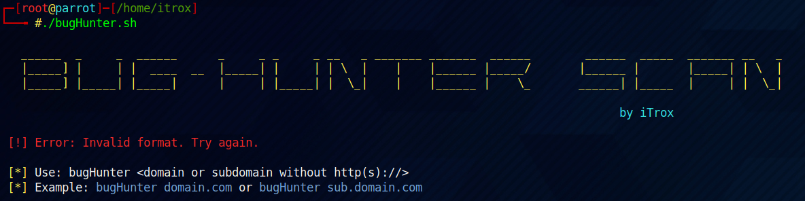

# **Bug-Hunter**

**In development**

Automated tool under scripting in Bash, which allows the collection of information in Bug Bounty programs.

* To use the tool at the system level from a relative path, it is recommended to create a symbolic link to the /usr/bin directory.

    + sudo ln -s /path/to/my/file/bugHunter.sh /usr/bin/bugHunter

## Use

- bugHunter <domain> <domain or subdomain without http(s)://>
