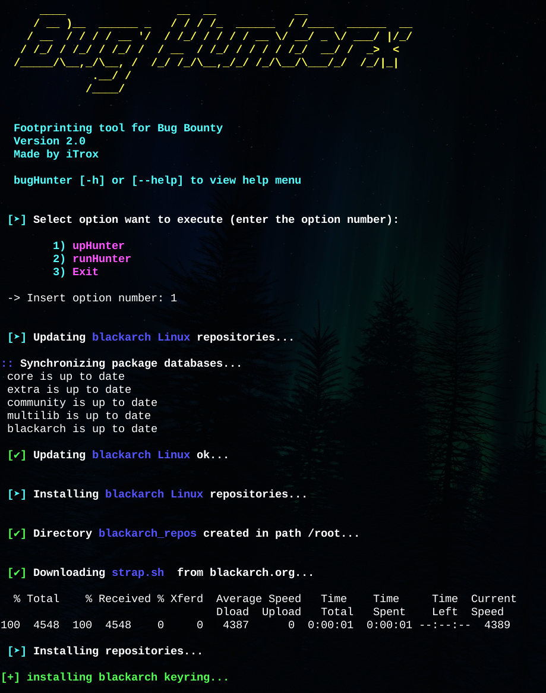
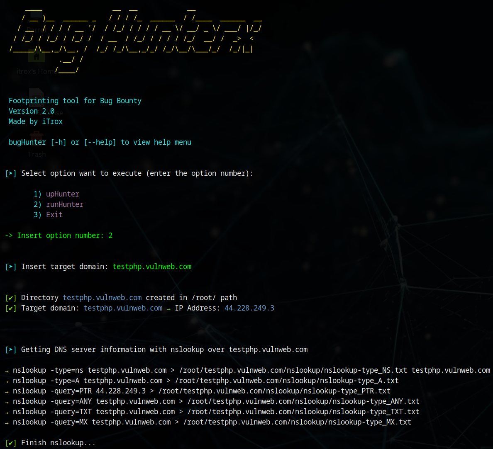

# **BugHunterx**

<div align="center">
  
</div>

CLI tool that allows to install a specific application environment to perform footprinting in BugBounty exercises against a specific initial domain.

The tool works on Debian (testing and working OK) and Arch Linux distributions (in testing, with possible bugs while a stable version is being implemented).

To show how it works, images of both distributions are shown.

---

## Install tool

* Download the repository to your system

```shell
sudo git -C /opt clone https://github.com/iTroxB/Bug-Hunterx.git
```

* To use the system-level tool as an executable from a relative path, it is recommended to create a symbolic link to the /usr/bin directory from your repository directory.

```shell
sudo chmod +x /opt/Bug-Hunterx/bugHunterx.sh
sudo ln -s /opt/Bug-Hunterx/bugHunterx.sh /usr/bin/bugHunterx
```

* To know the options and parameters of the tool run the help menu with the flag `-h` or `--help`.

```shell
bugHunterx -h
```

```shell
bugHunterx --help
```

<div align="center">
  
</div>

---

## Use tool

* **Note:** The tool only works as root user.


---

## Options

### Number 1

* If you select number 1 bugHunterx will get the current distribution type, update repositories and system and install a set of tools to prepare the Bug Bounty environment.



---

### Number 2

* If you select number 2 bugHunterx will ask you to enter a domain name. After that it will start scanning it, applying a series of tools with payloads specifically created to obtain as much useful information as possible prior to detecting web vulnerabilities.



---

## Recommended modifications

For Parrot Sec or any Parrot OS distribution, make the following changes to the source code of bugHunterx.sh

- The content of line 492 `apt upgrade -y` replace it with `parrot-upgrade`.
- Comment lines 495, 496, 497 and 498.

## Tools installed

| **Tools installed** | **Status** |
|----------------|-----------|
| golang-go | **✔** |
| python3 | **✔** |
| google-chrome | **✔** |
| zip | **✔** |
| unzip | **✔** |
| nslookup | **✔** |
| dig | **✔** |
| whois | **✔** |
| zaproxy | **✔** |
| burpsuite | **✔** |
| mapcidr | **✔** |
| dnsx | **✔** |
| amass | **✔** |
| cero | **✔** |
| katana | **✔** |
| httpx | **✔** |
| unfurl | **✔** |
| gau | **✔** |
| ctfr | **✔** |
| eog | **✔** |
| gowitness | **✔** |
| analyticsrelationships | **✔** |
| gobuster | **✔** |
| nuclei | **✔** |
| nuclei-templates | **✔** |
| SecLists | **✔** |
| nmap | **✔** |
| subfinder | **✔** |
