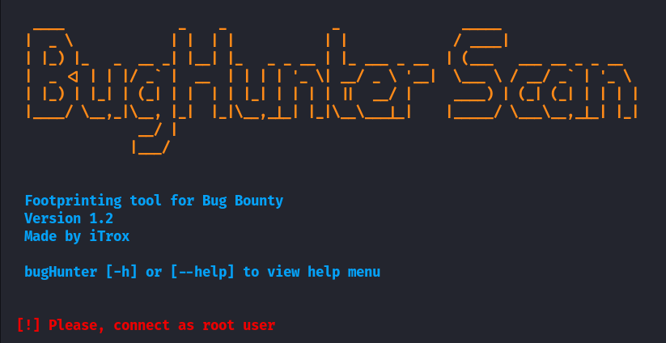
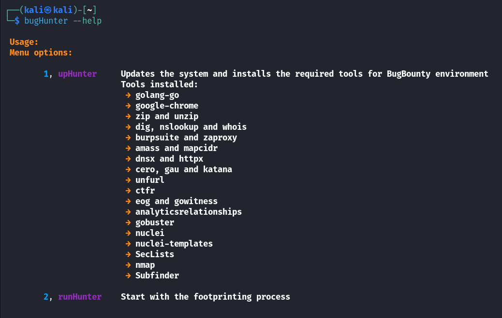

# **BugHunter Scan**

**In development**

Tool that allows to install a specific application environment to perform Bug Bounty, in Debian and ArchLinux distributions (under development), as well as to perform footprinting and fingerprinting against a specific domain.

* To use the tool at the system level from a relative path, it is recommended to create a symbolic link to the /usr/bin directory.

    + sudo ln -s /path/to/my/file/bugHunter.sh /usr/bin/bugHunter

## Use

| **Tools used** | **Status** |
|----------------|-----------|
| whois | **✔** |
| zaproxy | **✔** |      
| mapcidr | **✔** |
| dnsx | **✔** |
| massdns | **✔** |
| cero | **✔** |
| katana | **✔** |
| httpx | **✔** |
| unfurl | **✔** |
| gau | **✔** |
| ctfr | **✔** |
| gowitness | **✔** |
| analyticsrelationships | **✔** |
| gobuster | **✔** |
| nuclei | **✔** |
| nuclei-templates | **✔** |
|SecLists | **✔** |
