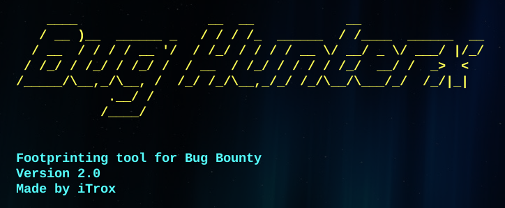
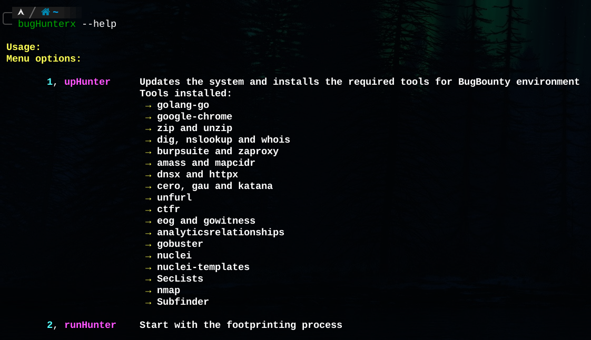
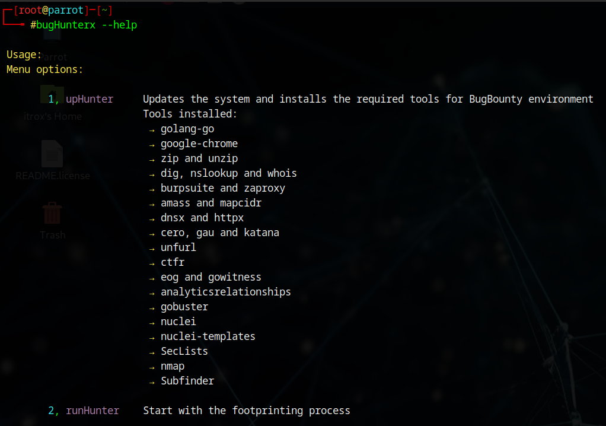
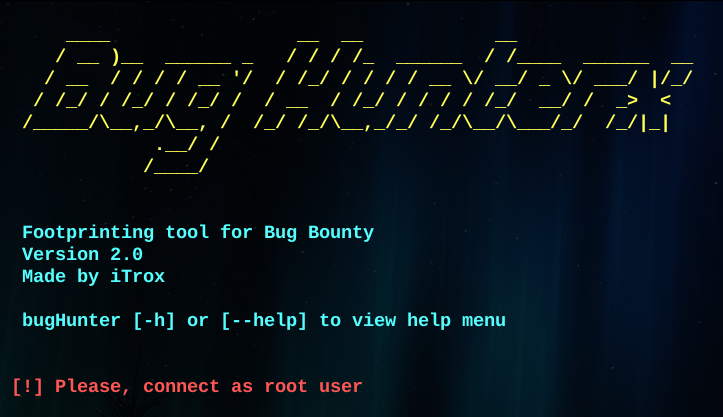

# **BugHunterx**

**In development**




CLI tool that allows to install a specific application environment to perform footprinting in BugBounty exercises against a specific initial domain.

The tool works on Debian (testing and working OK) and Arch Linux distributions (in testing, with possible bugs while a stable version is being implemented).

To show how it works, images of both distributions are shown.

---

## Symbolic Link

* To use the system-level tool as an executable from a relative path, it is recommended to create a symbolic link to the /usr/bin directory from your repository directory.

```shell
sudo ln -s /path/to/repository/bugHunterx/bugHunterx.sh /usr/bin/bugHunterx
```

---

## Use

* To know the options and parameters of the tool run the help menu with the flag `-h` or `--help`.

```shell
bugHunterx -h
```

```shell
bugHunterx --help
```

* View from Arch Linux distribution (myArch)



* View from Debian distribution (Parrot Sec)


* **Note:** The tool only works as root user.



---

## Options

### Number 1

* If you select number 1 bugHunterx will scan the type of distribution you are in, update the system and install a set of tools to prepare the Bug Bounty environment.

####

## Tools installed

| **Tools installed** | **Status** |
|----------------|-----------|
| golang-go | **✔** |
| google-chrome | **✔** |
| zip | **✔** |
| unzip | **✔** |
| nslookup | **✔** |
| dig | **✔** |
| whois | **✔** |
| zaproxy | **✔** |
| burpsuite | **✔** |
| mapcidr | **✔** |
| dnsx | **✔** |
| amass | **✔** |
| cero | **✔** |
| katana | **✔** |
| httpx | **✔** |
| unfurl | **✔** |
| gau | **✔** |
| ctfr | **✔** |
| eog | **✔** |
| gowitness | **✔** |
| analyticsrelationships | **✔** |
| gobuster | **✔** |
| nuclei | **✔** |
| nuclei-templates | **✔** |
| SecLists | **✔** |
| nmap | **✔** |
| subfinder | **✔** |
